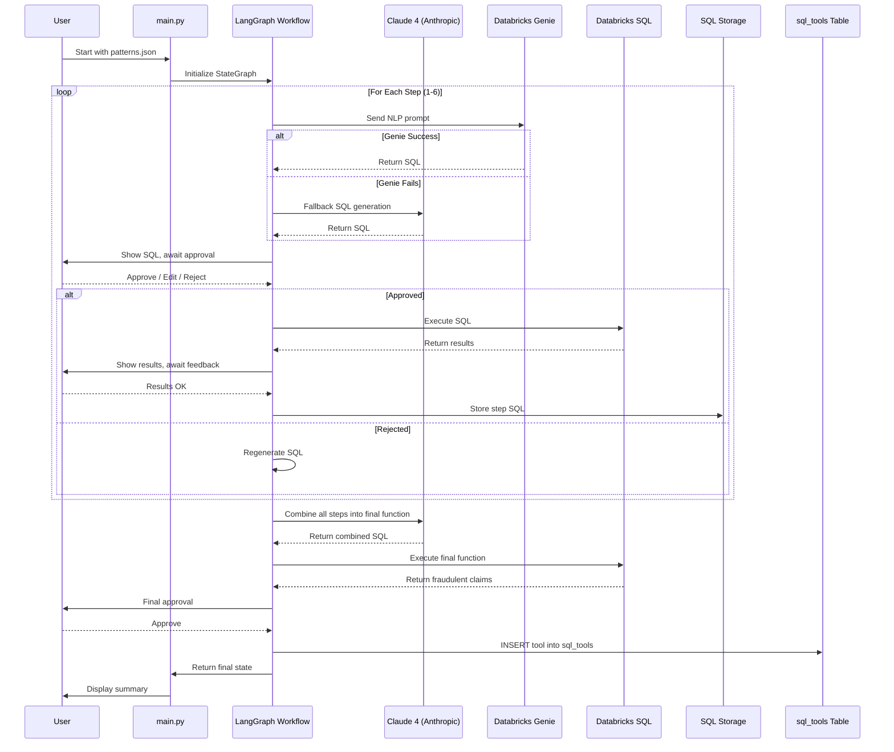
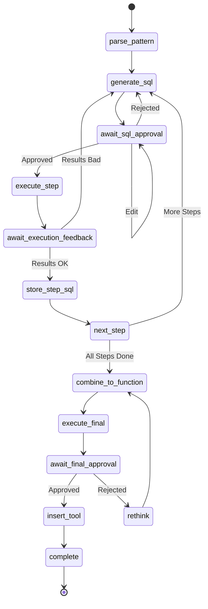

# Agentic Fraud Detection Framework - Complete Architecture

## End-to-End Overview

This document explains the complete architecture and workflow of the Agentic Fraud Detection Framework, from Databricks setup to pattern execution and tool management.

---

## 🏗️ Architecture Diagram

```mermaid
flowchart TB
    subgraph User["👤 User"]
        PatternJSON["patterns.json<br/>Fraud Detection Pattern"]
        ENV[".env<br/>Configuration"]
    end

    subgraph LocalSystem["💻 Local System"]
        subgraph AgenticFramework["🤖 Agentic Framework (LangGraph)"]
            Main["main.py / run_auto.py<br/>Entry Point"]
            Workflow["workflow.py<br/>LangGraph StateGraph"]
            State["state.py<br/>AgentState Management"]
            
            subgraph Nodes["📦 Workflow Nodes"]
                N1["parse_pattern"]
                N2["generate_sql"]
                N3["await_sql_approval"]
                N4["execute_step"]
                N5["await_execution_feedback"]
                N6["store_step_sql"]
                N7["next_step"]
                N8["combine_to_function"]
                N9["execute_final"]
                N10["await_final_approval"]
                N11["insert_tool"]
                N12["complete"]
            end
        end
        
        subgraph Tools["🔧 Tools"]
            GenieTool["genie_tool.py<br/>Databricks Genie API"]
            SQLExecutor["sql_executor.py<br/>Databricks SQL Connector"]
            SQLStorage["sql_storage.py<br/>Local MD Storage"]
        end
        
        Config["config.py<br/>Configuration Loader"]
        Output["output/sqlcode.md<br/>Generated SQL"]
    end

    subgraph Cloud["☁️ Cloud Services"]
        subgraph Anthropic["🧠 Anthropic API"]
            Claude["Claude 4<br/>(claude-sonnet-4-20250514)"]
        end
        
        subgraph Databricks["🔶 Databricks"]
            subgraph GenieSpace["Genie Space"]
                Genie["AI/BI Genie<br/>NLP to SQL"]
            end
            
            subgraph SQLWarehouse["SQL Warehouse"]
                DBSQL["SQL Execution Engine"]
            end
            
            subgraph UnityCatalog["Unity Catalog"]
                subgraph Catalog["fraud_detection"]
                    subgraph PolicySchema["policies (schema)"]
                        PoliciesTable["policies<br/>Policy Definitions"]
                        PatternsTable["patterns<br/>Fraud Patterns"]
                        ToolsTable["sql_tools<br/>Generated SQL Tools"]
                    end
                    
                    subgraph TestSchema["test_data (schema)"]
                        ClaimsTable["claims<br/>Medical Claims"]
                        ProvidersTable["providers<br/>Healthcare Providers"]
                        ProceduresTable["procedures<br/>Medical Procedures"]
                    end
                end
            end
        end
    end

    %% Connections
    User --> Main
    ENV --> Config
    PatternJSON --> Main
    Main --> Workflow
    Workflow --> State
    Workflow --> Nodes
    
    N2 --> GenieTool
    N2 --> Claude
    N4 --> SQLExecutor
    N6 --> SQLStorage
    N11 --> SQLExecutor
    
    GenieTool --> Genie
    SQLExecutor --> DBSQL
    DBSQL --> UnityCatalog
    
    SQLStorage --> Output
    
    N11 --> ToolsTable
    N4 --> ClaimsTable

    style Claude fill:#8B5CF6,color:#fff
    style Databricks fill:#FF6B00,color:#fff
    style ToolsTable fill:#10B981,color:#fff
    style ClaimsTable fill:#3B82F6,color:#fff
```



---

## 📊 Workflow Sequence Diagram



---

## 🗄️ Databricks Schema and Tables

### Step 1: Catalog and Schema Creation

```sql
-- Create the main catalog
CREATE CATALOG IF NOT EXISTS fraud_detection;

-- Create schemas
CREATE SCHEMA IF NOT EXISTS fraud_detection.policies;
CREATE SCHEMA IF NOT EXISTS fraud_detection.test_data;
```

### Step 2: Policy Tables

#### policies Table
Stores policy definitions that patterns belong to.

```sql
CREATE TABLE IF NOT EXISTS fraud_detection.policies.policies (
    policy_id STRING NOT NULL,           -- Primary key: UHC-POL-2026-0005A
    policy_name STRING NOT NULL,         -- "Global Days Policy, Professional"
    policy_number STRING,
    effective_date DATE,
    metadata MAP<STRING, STRING>,
    created_at TIMESTAMP,
    updated_at TIMESTAMP,
    _change_type STRING,
    _commit_version LONG
) USING DELTA;
```

#### patterns Table
Stores fraud detection patterns with NLP descriptions.

```sql
CREATE TABLE IF NOT EXISTS fraud_detection.policies.patterns (
    pattern_id STRING NOT NULL,          -- Primary key: FP-GD-001
    policy_id STRING NOT NULL,           -- Foreign key to policies
    pattern_name STRING NOT NULL,        -- "E/M Services During Global Period..."
    nlp_description STRING,              -- Natural language description
    severity STRING,                     -- HIGH, MEDIUM, LOW, CRITICAL
    status STRING,                       -- active, pending, disabled
    tool_id STRING,                      -- Foreign key to sql_tools (after generation)
    created_at TIMESTAMP,
    updated_at TIMESTAMP,
    _change_type STRING,
    _commit_version LONG
) USING DELTA
PARTITIONED BY (policy_id);
```

#### sql_tools Table
Stores generated SQL functions as reusable tools.

```sql
CREATE TABLE IF NOT EXISTS fraud_detection.policies.sql_tools (
    tool_id STRING NOT NULL,             -- Primary key: tool_FP-GD-001
    pattern_id STRING NOT NULL,          -- Foreign key to patterns
    policy_id STRING NOT NULL,           -- Foreign key to policies
    sql_query STRING NOT NULL,           -- The actual SQL code
    validation_status STRING,            -- validated, pending, failed
    validated_by STRING,                 -- Who validated it
    validated_at TIMESTAMP,              -- When validated
    last_executed TIMESTAMP,             -- Last execution time
    execution_count LONG DEFAULT 0,      -- How many times executed
    execution_time_ms DOUBLE,            -- Performance metric
    rows_returned LONG,                  -- Result count
    metadata MAP<STRING, STRING>,
    created_at TIMESTAMP,
    updated_at TIMESTAMP,
    _change_type STRING,
    _commit_version LONG
) USING DELTA
TBLPROPERTIES ('delta.feature.allowColumnDefaults'='supported');
```

### Step 3: Test Data Tables

#### claims Table
Sample medical claims data for fraud detection testing.

```sql
CREATE TABLE IF NOT EXISTS fraud_detection.test_data.claims (
    claim_id STRING NOT NULL,            -- CLM001, CLM002, ...
    patient_id STRING NOT NULL,          -- PAT001, PAT002, ...
    provider_npi STRING NOT NULL,        -- 10-digit NPI
    provider_tin STRING NOT NULL,        -- Tax ID
    provider_specialty STRING,           -- Orthopedic, Primary Care, ...
    service_date DATE NOT NULL,          -- Date of service
    procedure_code STRING,               -- CPT codes: 27447, 29881, ...
    global_days_value STRING,            -- '010', '090', '000', 'XXX'
    em_code STRING,                      -- E/M codes: 99213, 99214, ...
    modifier_24 STRING,                  -- NULL if missing (fraud indicator)
    modifier_58 STRING,
    fare_amount DOUBLE,
    claim_status STRING,                 -- pending, paid, denied
    created_at TIMESTAMP
) USING DELTA
PARTITIONED BY (service_date);
```

#### providers Table
Healthcare provider reference data.

```sql
CREATE TABLE IF NOT EXISTS fraud_detection.test_data.providers (
    provider_npi STRING NOT NULL,        -- Primary key
    provider_name STRING,
    provider_tin STRING,
    provider_specialty STRING,
    practice_group STRING
) USING DELTA;
```

#### procedures Table
Medical procedure reference data with global days.

```sql
CREATE TABLE IF NOT EXISTS fraud_detection.test_data.procedures (
    procedure_code STRING NOT NULL,      -- Primary key: 27447
    procedure_description STRING,        -- "Total knee arthroplasty"
    global_days_value STRING,            -- '010', '090', '000', 'XXX'
    is_surgical BOOLEAN,
    is_em BOOLEAN,
    category STRING
) USING DELTA;
```

---

## 🔄 Complete Execution Flow

### Phase 1: Setup (QUICK_START_DATABRICKS.md)

```
┌─────────────────────────────────────────────────────────────────┐
│  STEP 1: Create Databricks Infrastructure                       │
├─────────────────────────────────────────────────────────────────┤
│  • Create catalog: fraud_detection                              │
│  • Create schemas: policies, test_data                          │
│  • Create tables: policies, patterns, sql_tools                 │
│  • Create tables: claims, providers, procedures                 │
└─────────────────────────────────────────────────────────────────┘
                              │
                              ▼
┌─────────────────────────────────────────────────────────────────┐
│  STEP 2: Load Test Data                                         │
├─────────────────────────────────────────────────────────────────┤
│  • Insert sample claims (8 records)                             │
│  • Insert providers (3 records)                                 │
│  • Insert procedures (5 records)                                │
│  • Include fraud pattern examples (CLM001 - missing modifier)   │
└─────────────────────────────────────────────────────────────────┘
                              │
                              ▼
┌─────────────────────────────────────────────────────────────────┐
│  STEP 3: Load Policy and Patterns                               │
├─────────────────────────────────────────────────────────────────┤
│  • Insert policy: UHC-POL-2026-0005A                            │
│  • Insert patterns: FP-GD-001, FP-GD-002                        │
│  • Each pattern has NLP description and severity                │
└─────────────────────────────────────────────────────────────────┘
```

### Phase 2: Agentic Framework Execution

```
┌─────────────────────────────────────────────────────────────────┐
│  STEP 4: Initialize Agentic Framework                           │
├─────────────────────────────────────────────────────────────────┤
│  • Load .env configuration                                      │
│  • Initialize Claude 4 (Anthropic)                              │
│  • Initialize Databricks Genie tool                             │
│  • Initialize SQL Executor                                      │
│  • Create LangGraph StateGraph                                  │
└─────────────────────────────────────────────────────────────────┘
                              │
                              ▼
┌─────────────────────────────────────────────────────────────────┐
│  STEP 5: Process Pattern (6 Detection Steps)                    │
├─────────────────────────────────────────────────────────────────┤
│                                                                 │
│  For each step in pattern.detection_logic:                      │
│    ┌───────────────────────────────────────────────────────┐   │
│    │ 1. Generate SQL (Genie → Claude fallback)             │   │
│    │ 2. Human Review (approve/edit/reject)                 │   │
│    │ 3. Execute SQL against Databricks                     │   │
│    │ 4. Human Feedback on results                          │   │
│    │ 5. Store approved SQL                                 │   │
│    └───────────────────────────────────────────────────────┘   │
│                                                                 │
│  Step 1: Identify surgical procedures (global_days 010/090)     │
│  Step 2: Calculate global period end date                       │
│  Step 3: Find E/M services within global period                 │
│  Step 4: Filter same provider OR same TIN+specialty             │
│  Step 5: Filter missing modifier_24                             │
│  Step 6: Return fraudulent claims with details                  │
│                                                                 │
└─────────────────────────────────────────────────────────────────┘
                              │
                              ▼
┌─────────────────────────────────────────────────────────────────┐
│  STEP 6: Combine into Final Function                            │
├─────────────────────────────────────────────────────────────────┤
│  • Claude analyzes all 6 step SQLs                              │
│  • Generates optimized combined SQL with CTEs                   │
│  • Function name: detect_fp_gd_001                              │
│  • Execute and show results                                     │
└─────────────────────────────────────────────────────────────────┘
                              │
                              ▼
┌─────────────────────────────────────────────────────────────────┐
│  STEP 7: Insert Tool into Database                              │
├─────────────────────────────────────────────────────────────────┤
│  • INSERT into fraud_detection.policies.sql_tools               │
│  • UPDATE fraud_detection.policies.patterns SET tool_id         │
│  • Tool is now reusable and queryable                           │
└─────────────────────────────────────────────────────────────────┘
```

### Phase 3: Tool Usage (Post-Execution)

```
┌─────────────────────────────────────────────────────────────────┐
│  Retrieve and Execute Stored Tool                               │
├─────────────────────────────────────────────────────────────────┤
│                                                                 │
│  -- Get the tool                                                │
│  SELECT sql_query FROM fraud_detection.policies.sql_tools       │
│  WHERE tool_id = 'tool_FP-GD-001';                              │
│                                                                 │
│  -- Execute the stored SQL                                      │
│  -- (Copy sql_query and run it)                                 │
│                                                                 │
│  -- Track executions                                            │
│  UPDATE fraud_detection.policies.sql_tools                      │
│  SET execution_count = execution_count + 1,                     │
│      last_executed = CURRENT_TIMESTAMP()                        │
│  WHERE tool_id = 'tool_FP-GD-001';                              │
│                                                                 │
└─────────────────────────────────────────────────────────────────┘
```

---

## 📁 File Structure

```
demo/agentic_fraud_detection/
├── 📄 main.py                 # Interactive mode entry point
├── 📄 run_auto.py             # Auto-approval mode
├── 📄 insert_tool.py          # Standalone tool insertion
├── 📄 quick_test.py           # Local simulation
│
├── 📦 Core Framework
│   ├── 📄 workflow.py         # LangGraph StateGraph (749 lines)
│   ├── 📄 state.py            # AgentState TypedDict
│   ├── 📄 config.py           # Environment configuration
│   ├── 📄 genie_tool.py       # Databricks Genie API wrapper
│   ├── 📄 sql_executor.py     # Databricks SQL execution
│   └── 📄 sql_storage.py      # Local SQL storage (markdown)
│
├── 📦 Configuration
│   ├── 📄 .env                # Your credentials (gitignored)
│   ├── 📄 env.template        # Template for credentials
│   └── 📄 patterns.json       # Fraud detection patterns
│
├── 📦 Output
│   └── 📄 output/sqlcode.md   # Generated SQL code
│
└── 📦 Documentation
    ├── 📄 README.md           # Quick start guide
    └── 📄 ARCHITECTURE.md     # This file
```

---

## 🔐 Security & Configuration

### Environment Variables (.env)

```env
# Databricks
DATABRICKS_HOST=https://dbc-xxxxx.cloud.databricks.com
DATABRICKS_TOKEN=dapi_xxxxx

# Genie Space
GENIE_SPACE_ID=01f0e8ce532d1222823b0987645f6138

# SQL Warehouse
DBSQL_SERVER_HOSTNAME=dbc-xxxxx.cloud.databricks.com
DBSQL_HTTP_PATH=/sql/1.0/warehouses/xxxxx

# LLM (Anthropic Claude 4)
LLM_PROVIDER=anthropic
ANTHROPIC_API_KEY=sk-ant-api03-xxxxx
ANTHROPIC_MODEL=claude-sonnet-4-20250514

# Output
OUTPUT_DIR=./output
SQL_CODE_FILE=sqlcode.md
```

---

## 📈 Fraud Detection Results

### Pattern: FP-GD-001

**E/M Services During Global Period Without Modifier 24**

| Field | Value |
|-------|-------|
| Claim ID | CLM001 |
| Patient | PAT001 |
| Provider NPI | 1234567890 |
| E/M Code | 99213 |
| Service Date | 2024-01-20 |
| Surgical Procedure | 27447 (Total Knee Arthroplasty) |
| Global Days | 090 |
| Modifier 24 | **NULL (MISSING - FRAUD!)** |

**Interpretation:** An E/M service was billed during the 90-day global period of a surgical procedure without modifier 24, indicating the E/M was related to the surgery and should not be separately billed.

---

## 🔄 LangGraph State Machine



---

## 🎯 Key Technologies

| Technology | Purpose | Version |
|------------|---------|---------|
| **LangGraph** | Workflow orchestration | ≥0.2.0 |
| **Claude 4 (Anthropic)** | SQL generation | claude-sonnet-4-20250514 |
| **Databricks Genie** | NLP to SQL | - |
| **Databricks SQL Connector** | Query execution | ≥3.0.0 |
| **Delta Lake** | Data storage | - |
| **Unity Catalog** | Data governance | - |
| **Python** | Runtime | 3.12 |

---

## 🚀 Quick Commands

```bash
# Auto-run mode (no interaction)
python run_auto.py

# Interactive mode (human-in-the-loop)
python main.py

# Insert tool only (after successful run)
python insert_tool.py

# Local simulation (no Databricks)
python quick_test.py
```

---

## ✅ Success Criteria

The framework is successful when:

1. ✅ All 6 detection steps generate valid SQL
2. ✅ SQL executes against Databricks without errors
3. ✅ Fraudulent claims are correctly identified
4. ✅ Final function is combined and optimized
5. ✅ Tool is inserted into sql_tools table
6. ✅ Pattern is updated with tool_id reference
7. ✅ SQL code is saved to output/sqlcode.md
