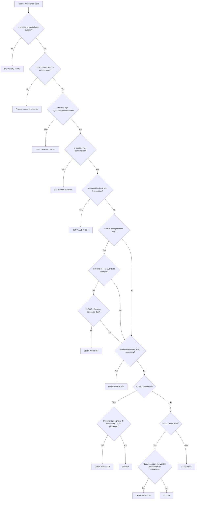

# UnitedHealthcare Ambulance Policy - Denial Rules & Fraud Tactics

**Policy Number:** 2026R0123A  
**Source:** [UHC Ambulance Policy PDF](https://www.uhcprovider.com/content/dam/provider/docs/public/policies/comm-reimbursement/COMM-Ambulance-Policy.pdf)

---

## Claim Adjudication Flowchart



---

## Code Reference Tables

### Ambulance Transportation Codes
| Code | Description |
|------|-------------|
| A0021 | Ambulance service, outside state per mile |
| A0225 | Ambulance service, neonatal transport |
| A0380 | BLS mileage (per mile) |
| A0390 | ALS mileage (per mile) |
| A0420 | Ambulance waiting time (ALS/BLS) per half hour |
| A0425 | Ground mileage, per statute mile |
| A0426 | Ambulance service, ALS nonemergency |
| A0427 | Ambulance service, ALS emergency |
| A0428 | Ambulance service, BLS nonemergency |
| A0429 | Ambulance service, BLS emergency |
| A0430 | Ambulance service, paramedic intercept |
| A0431 | Ambulance service, rotary wing (helicopter) |
| A0432 | Paramedic intercept, rural |
| A0433 | ALS Level 2 (ALS2) |
| A0434 | Specialty care transport (SCT) |
| A0435 | Fixed wing air transport |
| A0436 | Rotary wing air transport |
| A0888 | Noncovered ambulance mileage |
| A0998 | Ambulance response and treatment, no transport |
| A0999 | Unlisted ambulance service |

### Origin/Destination Modifier Characters
| Code | Location |
|------|----------|
| D | Diagnostic or therapeutic site (other than P or H) |
| E | Residential, domiciliary, custodial facility (non-SNF) |
| G | Hospital-based ESRD facility |
| H | Hospital |
| I | Site of transfer (airport, helipad) |
| J | Freestanding ESRD facility |
| N | Skilled Nursing Facility (SNF) |
| P | Physician's office |
| R | Residence |
| S | Scene of accident or acute event |
| X | Intermediate stop at physician's office (DESTINATION ONLY) |

### Valid Ambulance Modifiers (Two-digit combinations)
```
DD, DE, DG, DH, DI, DJ, DN, DP, DR, DS, DX
ED, EE, EG, EH, EI, EJ, EN, EP, ER, ES, EX
GD, GE, GG, GH, GI, GJ, GN, GP, GR, GS, GX
HD, HE, HG, HH, HI, HJ, HN, HP, HR, HS, HX
ID, IE, IG, IH, II, IJ, IN, IP, IR, IS, IX
JD, JE, JG, JH, JI, JJ, JN, JP, JR, JS, JX
ND, NE, NG, NH, NI, NJ, NN, NP, NR, NS, NX
PD, PE, PG, PH, PI, PJ, PN, PP, PR, PS, PX
QL, RD, RE, RG, RH, RI, RJ, RN, RP, RR, RS, RX
SD, SE, SG, SH, SI, SJ, SN, SP, SR, SS, SX
```

### Bundled Codes (Not Separately Reimbursable with Ambulance)
*Per policy: oxygen, drugs, extra attendants, supplies, EKG, night differential, backboards, neckboards, splints are included in base rate.*

| Category | Example Codes |
|----------|---------------|
| Oxygen | E0424-E0480, A4611-A4627 |
| Drugs/Medications | J-codes administered during transport |
| Supplies | A4000-A4999 range |
| EKG | 93000-93010 |
| Night differential | Included in base |
| Equipment | Backboards, splints, etc. |

**Full Bundled Codes List:** See [UHC Policy Attachments](https://www.uhcprovider.com/content/dam/provider/docs/public/policies/comm-reimbursement/COMM-Ambulance-Policy.pdf)

---

## DENIAL RULES

---

### RULE AMB-001: Non-Ambulance Supplier Billing Ambulance Codes

**1. Denial Code Description:**  
`AMB-PROV` - Ambulance service codes (A0021, A0225-A0999) billed by non-Ambulance Supplier. Only certified Ambulance Suppliers are eligible for reimbursement.

**2. HCPCS Codes Required:**
| Codes Subject to Edit |
|----------------------|
| A0021, A0225-A0999 |

**3. Modifiers:**  
N/A - Edit based on provider type, not modifiers.

**4. Other Codes/ICD:**  
N/A

**5. Denial Conditions:**
- PROVIDER_TYPE ≠ AMBULANCE_SUPPLIER
- CODE in range A0021, A0225-A0999

**6. Detection Logic:**  
Check provider specialty/taxonomy code. If provider is not classified as Ambulance Supplier (e.g., ER physician, hospital) and claim contains ambulance HCPCS codes A0021 or A0225-A0999, deny claim. Non-ambulance providers should bill CPT codes for their services (e.g., 92950 for CPR).

**7. Simulated Claims:**

| Claim | Provider Type | Specialty | Code | Result |
|-------|--------------|-----------|------|--------|
| CLM-001 | NPI-111 | Emergency Medicine | A0427 | **DENIED: AMB-PROV** |
| CLM-002 | NPI-222 | Ambulance Supplier | A0427 | **PAID** |

| Claim | Provider | Taxonomy | Code | Correct Billing |
|-------|----------|----------|------|-----------------|
| CLM-003 | Hospital ER | 282N00000X | A0429 | **DENIED** - Should bill facility charges |

---

### RULE AMB-002: Missing Origin/Destination Modifier

**1. Denial Code Description:**  
`AMB-MOD-MISS` - Ambulance transportation code billed without required two-digit origin/destination modifier. All ambulance transports must include modifier indicating pickup and dropoff locations.

**2. HCPCS Codes Required:**
| Codes Requiring Modifier |
|-------------------------|
| A0021, A0225, A0380, A0390, A0420, A0425, A0426, A0427, A0428, A0429, A0430, A0431, A0432, A0433, A0434, A0435, A0436, A0888, A0998, A0999 |

**3. Modifiers:**  
REQUIRED: Any valid two-digit combination from origin/destination list (e.g., RH, SH, NH, HH)

**4. Other Codes/ICD:**  
N/A

**5. Denial Conditions:**
- CODE in Ambulance Transportation list
- MODIFIER is NULL or NOT in valid combination list

**6. Detection Logic:**  
If claim contains ambulance transportation code AND modifier field is empty or does not contain a valid two-character origin/destination modifier from the approved list, deny claim.

**7. Simulated Claims:**

| Claim | DOS | Code | Modifier | Result |
|-------|-----|------|----------|--------|
| CLM-004 | 2025-01-15 | A0427 | (none) | **DENIED: AMB-MOD-MISS** |
| CLM-005 | 2025-01-15 | A0427 | RH | **PAID** |

| Claim | DOS | Code | Modifier | Result |
|-------|-----|------|----------|--------|
| CLM-006 | 2025-01-16 | A0429 | 59 | **DENIED: AMB-MOD-MISS** (59 is not O/D modifier) |
| CLM-007 | 2025-01-16 | A0429 | SH | **PAID** |

---

### RULE AMB-003: Invalid X Modifier Position

**1. Denial Code Description:**  
`AMB-MOD-X` - Modifier "X" (intermediate stop at physician's office) used in first position. X must only appear in second position as destination code.

**2. HCPCS Codes Required:**
| Codes Subject to Edit |
|----------------------|
| All ambulance transportation codes (A0021, A0225-A0999) |

**3. Modifiers:**  
- INVALID: XD, XE, XG, XH, XI, XJ, XN, XP, XR, XS, XX (X in first position)
- VALID: RX, SX, HX, NX, PX, etc. (X in second position only)

**4. Other Codes/ICD:**  
N/A

**5. Denial Conditions:**
- MODIFIER first character = "X"

**6. Detection Logic:**  
Parse the two-digit modifier. If the first character is "X", deny claim. X is only valid as destination (second position) indicating intermediate stop at physician's office en route to hospital.

**7. Simulated Claims:**

| Claim | DOS | Code | Modifier | Result |
|-------|-----|------|----------|--------|
| CLM-008 | 2025-01-17 | A0428 | XH | **DENIED: AMB-MOD-X** |
| CLM-009 | 2025-01-17 | A0428 | RX | **PAID** |

| Claim | DOS | Code | Modifier | Interpretation | Result |
|-------|-----|------|----------|----------------|--------|
| CLM-010 | 2025-01-18 | A0427 | SX | Scene to physician stop to hospital | **PAID** |
| CLM-011 | 2025-01-18 | A0427 | XS | Invalid - X cannot be origin | **DENIED: AMB-MOD-X** |

---

### RULE AMB-004: Bundled Service Billed Separately

**1. Denial Code Description:**  
`AMB-BUND` - Service that is included in ambulance base rate billed separately. Oxygen, drugs, supplies, EKG, extra attendants, equipment are bundled into ambulance transport codes.

**2. HCPCS/CPT Codes Required:**
| Ambulance Base Codes | Bundled Codes (Examples) |
|---------------------|-------------------------|
| A0426-A0436 | E0424-E0480 (oxygen), J-codes (drugs), A4xxx (supplies), 93000-93010 (EKG) |

**3. Modifiers:**  
None override bundling.

**4. Other Codes/ICD:**  
N/A

**5. Denial Conditions:**
- SAME_DOS
- SAME_PROVIDER (Same Ambulance Supplier)
- AMBULANCE_CODE + BUNDLED_CODE on same claim

**6. Detection Logic:**  
If claim from Ambulance Supplier contains ambulance transport code AND separately billed oxygen, drugs, supplies, EKG, or equipment codes on same date of service, deny the bundled codes. Only the base ambulance transport code is reimbursable.

**7. Simulated Claims:**

| Claim | DOS | Code | Description | Result |
|-------|-----|------|-------------|--------|
| CLM-012 | 2025-01-19 | A0427 | ALS Emergency | **PAID** |
| CLM-012 | 2025-01-19 | E0424 | Oxygen supply | **DENIED: AMB-BUND** |
| CLM-012 | 2025-01-19 | 93010 | EKG interpretation | **DENIED: AMB-BUND** |

| Claim | DOS | Code | Description | Result |
|-------|-----|------|-------------|--------|
| CLM-013 | 2025-01-20 | A0433 | ALS2 transport | **PAID** |
| CLM-013 | 2025-01-20 | J0170 | Adrenalin injection | **DENIED: AMB-BUND** |

---

### RULE AMB-005: Ambulance During Inpatient Stay

**1. Denial Code Description:**  
`AMB-INPT` - Ambulance transport between facilities during inpatient stay (for diagnostics or specialty treatment) is not separately reimbursable. Excludes admit and discharge dates.

**2. HCPCS Codes Required:**
| Codes Subject to Edit |
|----------------------|
| All ambulance codes with modifiers HH, DH, HD (hospital-to-hospital, diagnostic-to-hospital, hospital-to-diagnostic) |

**3. Modifiers:**  
- HH (Hospital to Hospital)
- DH (Diagnostic site to Hospital)
- HD (Hospital to Diagnostic site)

**4. Other Codes/ICD:**  
Cross-reference with inpatient admission/discharge dates.

**5. Denial Conditions:**
- MODIFIER in (HH, DH, HD)
- DOS > ADMIT_DATE
- DOS < DISCHARGE_DATE
- PATIENT_STATUS = INPATIENT

**6. Detection Logic:**  
If ambulance claim has modifier HH, DH, or HD AND date of service falls between inpatient admission date and discharge date (exclusive of admit and discharge dates), deny claim. The originating facility is responsible for transport costs.

**7. Simulated Claims:**

| Claim | Admit | DOS | Discharge | Modifier | Code | Result |
|-------|-------|-----|-----------|----------|------|--------|
| CLM-014 | 01/15 | 01/17 | 01/20 | HD | A0428 | **DENIED: AMB-INPT** |
| CLM-015 | 01/15 | 01/15 | 01/20 | HD | A0428 | **PAID** (Admit date) |
| CLM-016 | 01/15 | 01/20 | 01/20 | DH | A0428 | **PAID** (Discharge date) |

---

### RULE AMB-006: ALS2 Without Required Interventions

**1. Denial Code Description:**  
`AMB-ALS2` - ALS Level 2 (A0433) billed without documentation of required interventions: either 3+ IV medication administrations (excluding crystalloid) OR one ALS2 procedure.

**2. HCPCS Codes Required:**
| Code | Description |
|------|-------------|
| A0433 | Ambulance service, ALS Level 2 |

**3. Modifiers:**  
N/A - Documentation review required.

**4. Other Codes/ICD:**  
ALS2 Qualifying Procedures (documentation required):
- Manual defibrillation/cardioversion
- Endotracheal intubation
- Central venous line
- Cardiac pacing
- Chest decompression
- Surgical airway
- Intraosseous line

**5. Denial Conditions:**
- CODE = A0433
- DOCUMENTATION does NOT show:
  - 3+ separate IV push/bolus or continuous infusion medications (excluding crystalloid/saline), OR
  - At least one ALS2 procedure from list

**6. Detection Logic:**  
If A0433 (ALS2) is billed, verify documentation shows either: (1) at least three separate administrations of IV medications (excluding crystalloid fluids like normal saline or lactated ringers), OR (2) at least one ALS2 procedure performed. If neither criteria met, downcode to A0427 (ALS1) or deny.

**7. Simulated Claims:**

| Claim | Code | IV Meds | ALS2 Procedure | Result |
|-------|------|---------|----------------|--------|
| CLM-017 | A0433 | 2 IV meds | None | **DENIED: AMB-ALS2** (downcode to A0427) |
| CLM-018 | A0433 | 1 IV med | Intubation | **PAID** |
| CLM-019 | A0433 | 4 IV meds | None | **PAID** |

| Claim | Code | Documentation | Result |
|-------|------|---------------|--------|
| CLM-020 | A0433 | "3 IV fluids given" (crystalloid) | **DENIED: AMB-ALS2** (crystalloid excluded) |
| CLM-021 | A0433 | "Epinephrine, Atropine, Lidocaine IV push" | **PAID** (3 non-crystalloid meds) |

---

### RULE AMB-007: ALS1 Without Assessment or Intervention

**1. Denial Code Description:**  
`AMB-ALS1` - ALS Level 1 (A0426/A0427) billed without documentation of ALS assessment or ALS intervention.

**2. HCPCS Codes Required:**
| Code | Description |
|------|-------------|
| A0426 | ALS nonemergency transport |
| A0427 | ALS emergency transport |

**3. Modifiers:**  
N/A

**4. Other Codes/ICD:**  
N/A

**5. Denial Conditions:**
- CODE in (A0426, A0427)
- DOCUMENTATION does NOT show ALS assessment or ALS intervention performed

**6. Detection Logic:**  
If ALS1 code billed, verify documentation shows either an ALS assessment (assessment by ALS crew required due to reported condition) or at least one ALS intervention (procedure requiring EMT-Intermediate or Paramedic). If not documented, downcode to BLS (A0428/A0429).

**7. Simulated Claims:**

| Claim | Code | Documentation | Result |
|-------|------|---------------|--------|
| CLM-022 | A0427 | "Patient stable, no interventions" | **DENIED: AMB-ALS1** (downcode to A0429) |
| CLM-023 | A0427 | "IV started, cardiac monitoring" | **PAID** |

---

### RULE AMB-008: Duplicate Transport Same DOS

**1. Denial Code Description:**  
`AMB-DUP` - Multiple ambulance transports billed for same patient on same date with same or overlapping origin/destination without documentation of separate trips.

**2. HCPCS Codes Required:**
| Codes Subject to Edit |
|----------------------|
| All ambulance transport codes |

**3. Modifiers:**  
Same origin/destination modifier on multiple claims.

**4. Other Codes/ICD:**  
N/A

**5. Denial Conditions:**
- SAME_PATIENT
- SAME_DOS
- SAME_MODIFIER (or logically impossible combination)
- SAME_AMBULANCE_SUPPLIER

**6. Detection Logic:**  
If multiple ambulance transport codes billed for same patient on same date by same Ambulance Supplier with identical or logically impossible modifier combinations (e.g., two RH transports same day), deny duplicate. Allow if documentation supports multiple legitimate trips.

**7. Simulated Claims:**

| Claim | DOS | Supplier | Modifier | Code | Result |
|-------|-----|----------|----------|------|--------|
| CLM-024 | 01/25 | TIN-111 | RH | A0429 | **PAID** |
| CLM-025 | 01/25 | TIN-111 | RH | A0429 | **DENIED: AMB-DUP** |

---

## FRAUD TACTICS / EXPLOITATION PATTERNS

---

### TACTIC AMB-FT001: Level of Service Upcoding

**1. Description:**  
Provider bills ALS2 (A0433) or ALS1 (A0427) when actual service provided was BLS level.

**2. HCPCS Codes Exploited:**  
A0433 (ALS2), A0427 (ALS1), A0426 (ALS nonemergency)

**3. Modifiers Misused:**  
N/A

**4. Other Codes:**  
N/A

**5. Exploitation Logic:**  
Bill highest-reimbursement ALS2 code for routine transports. Falsify documentation to show interventions not performed. Common in non-emergency transports and dialysis transports.

**6. Example Fraud Claim:**

| Claim | Actual Service | Code Billed | Documentation Claim |
|-------|----------------|-------------|---------------------|
| CLM-F1 | BLS transport, no interventions | A0433 | "Intubation performed" (false) |
| CLM-F2 | BLS dialysis transport | A0427 | "ALS assessment required" (false) |

---

### TACTIC AMB-FT002: False Origin/Destination Modifiers

**1. Description:**  
Provider falsifies origin or destination to bill for longer mileage or to avoid inpatient overlap denial.

**2. HCPCS Codes Exploited:**  
A0425 (mileage), all transport codes

**3. Modifiers Misused:**  
- Using S (scene) when pickup was scheduled (RH)
- Using R (residence) when pickup was from facility (NH)
- Avoiding HH/HD modifiers during inpatient stays

**4. Other Codes:**  
A0380, A0390, A0425 (mileage codes)

**5. Exploitation Logic:**  
Falsify origin as "Scene" (S) to bill as emergency instead of non-emergency scheduled transport. Change facility pickup to "Residence" to avoid institutional transport rules. Bill excessive mileage based on false route.

**6. Example Fraud Claim:**

| Claim | Actual Transport | Modifier Billed | True Modifier |
|-------|------------------|-----------------|---------------|
| CLM-F3 | SNF to Hospital (scheduled) | SH (scene to hospital) | NH |
| CLM-F4 | Hospital to Hospital (inpatient) | RH (residence to hospital) | HH |

---

### TACTIC AMB-FT003: Supplies/Equipment Unbundling

**1. Description:**  
Provider separately bills oxygen, drugs, supplies, EKG that are included in ambulance base rate.

**2. HCPCS Codes Exploited:**  
E0424-E0480 (oxygen), J-codes (drugs), A4xxx (supplies), 93000-93010 (EKG)

**3. Modifiers Misused:**  
59, XE (claiming services are separate)

**4. Other Codes:**  
Any supply, drug, or equipment codes

**5. Exploitation Logic:**  
Bill ambulance transport base code, then separately bill every supply, medication, and equipment used during transport. May use modifier 59 to bypass bundling edits.

**6. Example Fraud Claim:**

| Claim | DOS | Code | Description | Correct |
|-------|-----|------|-------------|---------|
| CLM-F5 | 02/01 | A0427 | ALS transport | Paid |
| CLM-F5 | 02/01 | E0424 | Oxygen tank | **Bundled** |
| CLM-F5 | 02/01 | J0170 | Epinephrine | **Bundled** |
| CLM-F5 | 02/01 | A4615 | Cannula | **Bundled** |
| CLM-F5 | 02/01 | 93010 | EKG | **Bundled** |

---

### TACTIC AMB-FT004: Provider Type Misrepresentation

**1. Description:**  
Non-ambulance entity bills ambulance codes by falsely registering as Ambulance Supplier or using ambulance supplier NPI.

**2. HCPCS Codes Exploited:**  
A0021, A0225-A0999

**3. Modifiers Misused:**  
N/A

**4. Other Codes:**  
N/A

**5. Exploitation Logic:**  
Hospital, physician group, or other entity bills ambulance codes using affiliated ambulance service NPI/TIN without actually providing ambulance transport. Shell company billing.

**6. Example Fraud Claim:**

| Claim | Billing Entity | Actual Service | Code |
|-------|---------------|----------------|------|
| CLM-F6 | ER Physician group | ER services only | A0427 (fraudulent) |
| CLM-F7 | Shell company | No transport occurred | A0429 |

---

### TACTIC AMB-FT005: Inpatient Transport Concealment

**1. Description:**  
Provider manipulates modifiers to conceal that transport occurred during inpatient stay, avoiding AMB-INPT denial.

**2. HCPCS Codes Exploited:**  
All transport codes

**3. Modifiers Misused:**  
- Using RH instead of HH
- Using NH instead of HH
- Falsifying origin/destination

**4. Other Codes:**  
N/A

**5. Exploitation Logic:**  
When patient is inpatient and transported to another facility for diagnostic test, bill with RH (residence to hospital) or other modifier instead of HD/DH/HH to avoid inpatient overlap edit.

**6. Example Fraud Claim:**

| Claim | Patient Status | Actual Transport | Modifier Billed |
|-------|---------------|------------------|-----------------|
| CLM-F8 | Inpatient Day 3 | Hospital to MRI center | RD (residence to diagnostic) |
| CLM-F9 | Inpatient Day 5 | Hospital to dialysis | NJ (SNF to ESRD) |

---

### TACTIC AMB-FT006: Scene Call Fabrication

**1. Description:**  
Provider bills emergency transport with "S" (scene) origin when transport was scheduled or non-emergency.

**2. HCPCS Codes Exploited:**  
A0427 (ALS emergency), A0429 (BLS emergency)

**3. Modifiers Misused:**  
S_ modifiers (SH, SD, SN, etc.)

**4. Other Codes:**  
N/A

**5. Exploitation Logic:**  
Bill scheduled dialysis or nursing home transports as "scene calls" (emergency) to receive higher emergency rate reimbursement. Emergency codes pay more than non-emergency (A0426, A0428).

**6. Example Fraud Claim:**

| Claim | Actual Service | Code Billed | Correct Code |
|-------|----------------|-------------|--------------|
| CLM-F10 | Scheduled dialysis transport | A0427 + SH | A0426 + RJ |
| CLM-F11 | Nursing home doctor visit | A0429 + SH | A0428 + NP |

---

### TACTIC AMB-FT007: Mileage Inflation

**1. Description:**  
Provider bills excessive mileage that does not match actual point-to-point distance.

**2. HCPCS Codes Exploited:**  
A0380 (BLS mileage), A0390 (ALS mileage), A0425 (ground mileage)

**3. Modifiers Misused:**  
N/A

**4. Other Codes:**  
N/A

**5. Exploitation Logic:**  
Bill mileage significantly higher than actual distance between origin and destination. Claim "detours" or "traffic routes" to justify inflated mileage. Pattern: Mileage 2-3x actual Google Maps distance.

**6. Example Fraud Claim:**

| Claim | Origin | Destination | Actual Miles | Billed Miles |
|-------|--------|-------------|--------------|--------------|
| CLM-F12 | 123 Main St | City Hospital | 8 miles | 24 miles |
| CLM-F13 | SNF ABC | Dialysis Center | 5 miles | 15 miles |

---

### TACTIC AMB-FT008: Duplicate Transport Billing

**1. Description:**  
Provider bills same transport multiple times or bills both transporting company and backup ambulance.

**2. HCPCS Codes Exploited:**  
All ambulance transport codes

**3. Modifiers Misused:**  
None

**4. Other Codes:**  
N/A

**5. Exploitation Logic:**  
Submit same claim multiple times with slight variations. Bill for ambulance that responded but did not transport (when another ambulance transported). Bill round trips as two separate one-way transports at higher rate.

**6. Example Fraud Claim:**

| Claim | DOS | Provider | Modifier | Code | Actual |
|-------|-----|----------|----------|------|--------|
| CLM-F14A | 02/10 | Ambulance A | RH | A0427 | Transported patient |
| CLM-F14B | 02/10 | Ambulance B | RH | A0427 | Only responded, did not transport |

---

## Summary Tables

### Denial Rules Summary
| Rule ID | Denial Code | Description | Key Trigger |
|---------|-------------|-------------|-------------|
| AMB-001 | AMB-PROV | Non-ambulance supplier | Provider type mismatch |
| AMB-002 | AMB-MOD-MISS | Missing O/D modifier | No modifier present |
| AMB-003 | AMB-MOD-X | X in first position | Invalid modifier format |
| AMB-004 | AMB-BUND | Bundled service separate | Supplies/drugs with transport |
| AMB-005 | AMB-INPT | Inpatient overlap | DOS within admit-discharge |
| AMB-006 | AMB-ALS2 | ALS2 without criteria | Missing 3+ IV or procedure |
| AMB-007 | AMB-ALS1 | ALS1 without criteria | No assessment/intervention |
| AMB-008 | AMB-DUP | Duplicate transport | Same DOS, same modifier |

### Fraud Tactics Summary
| Tactic ID | Tactic Name | Risk Level |
|-----------|-------------|------------|
| AMB-FT001 | Level of Service Upcoding | HIGH |
| AMB-FT002 | False Origin/Destination Modifiers | HIGH |
| AMB-FT003 | Supplies/Equipment Unbundling | MEDIUM |
| AMB-FT004 | Provider Type Misrepresentation | HIGH |
| AMB-FT005 | Inpatient Transport Concealment | HIGH |
| AMB-FT006 | Scene Call Fabrication | HIGH |
| AMB-FT007 | Mileage Inflation | HIGH |
| AMB-FT008 | Duplicate Transport Billing | MEDIUM |

---

**Policy Source:** [UHC Ambulance Policy 2026R0123A](https://www.uhcprovider.com/content/dam/provider/docs/public/policies/comm-reimbursement/COMM-Ambulance-Policy.pdf)  
**HCPCS Reference:** [CMS HCPCS Code Sets](https://www.cms.gov/Medicare/Coding/HCPCSReleaseCodeSets)  
**CMS Ambulance Guidelines:** [Medicare Benefit Policy Manual, Chapter 10](https://www.cms.gov/Regulations-and-Guidance/Guidance/Manuals/Downloads/bp102c10.pdf)
