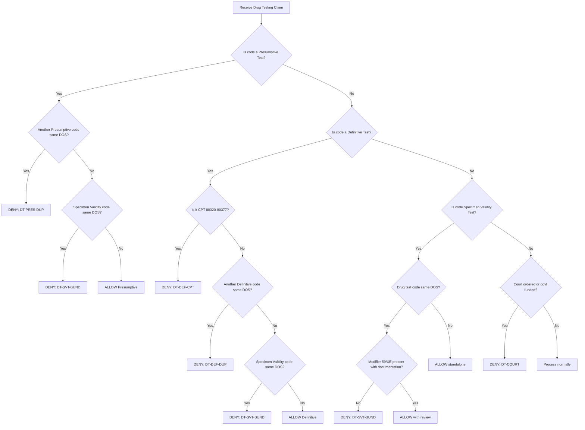

# UnitedHealthcare Drug Testing Policy - Denial Rules & Fraud Tactics

**Policy Number:** 2025R6005B  
**Source:** [UHC Drug Testing Policy PDF](https://www.uhcprovider.com/content/dam/provider/docs/public/policies/comm-reimbursement/COMM-Drug-Testing-Policy.pdf)

---

## Claim Adjudication Flowchart

---

## Code Reference Tables

### Presumptive Drug Testing Codes (Max 1/day)
| Code | Description |
|------|-------------|
| 80305 | Presumptive drug class screening - direct optical observation |
| 80306 | Presumptive drug class screening - instrument assisted |
| 80307 | Presumptive drug class screening - instrumented chemistry analyzers |
| H0003 | Alcohol and/or drug screening; laboratory analysis |

### Definitive Drug Testing Codes (Max 1/day)
| Code | Description |
|------|-------------|
| G0480 | Drug test(s), definitive, 1-7 drug class(es) |
| G0481 | Drug test(s), definitive, 8-14 drug class(es) |
| G0482 | Drug test(s), definitive, 15-21 drug class(es) |
| G0483 | Drug test(s), definitive, 22+ drug class(es) |
| G0659 | Drug test(s), definitive, utilizing drug identification methods |
| 0007U-0587U | PLA codes (proprietary lab analysis) - see [CMS PLA Code List](https://www.cms.gov/Medicare/Coding/place-of-service-codes/PLA_codes) |

### Non-Reimbursable Definitive Codes
| Code Range | Status |
|------------|--------|
| 80320-80377 | **NON-REIMBURSABLE** - Use G0480-G0483 or G0659 instead |

### Specimen Validity Testing Codes (Bundled - Not Separate)
| Codes |
|-------|
| 81000, 81001, 81002, 81003, 81005, 82542, 82570, 83516, 83518, 83519, 83520, 83789, 83986, 84156, 84311 |

---

## DENIAL RULES

---

### RULE DT-001: Duplicate Presumptive Drug Test

**1. Denial Code Description:**  
`DT-PRES-DUP` - Multiple presumptive drug tests billed on same date of service. Only one presumptive drug test is reimbursable per day regardless of methodology, number of drug classes, or billing provider.

**2. CPT/HCPCS Codes Required:**
| Primary Codes | Duplicate Trigger Codes |
|---------------|------------------------|
| 80305, 80306, 80307, H0003 | Any other code from: 80305, 80306, 80307, H0003 |

**3. Modifiers:**  
None override this edit. Modifier will NOT allow separate reimbursement per Q&A #1.

**4. Other Codes/ICD:**  
N/A - This is a code-to-code same-day edit.

**5. Denial Conditions:**
- SAME_DAY (date of service)
- SAME_PATIENT (member ID)
- ANY_PROVIDER (same or different - edit still applies)
- ANY_TIN (same or different - edit still applies)

**6. Detection Logic:**  
Count all presumptive drug test codes (80305, 80306, 80307, H0003) for the same patient on the same date of service across ALL providers and ALL claims. If count > 1, deny the subsequent claim(s).

**7. Simulated Claims:**

| Claim | DOS | Provider | Code | Units | Result |
|-------|-----|----------|------|-------|--------|
| CLM-001 | 2025-01-15 | NPI-111 | 80305 | 1 | **PAID** |
| CLM-002 | 2025-01-15 | NPI-111 | 80307 | 1 | **DENIED: DT-PRES-DUP** |

| Claim | DOS | Provider | Code | Units | Result |
|-------|-----|----------|------|-------|--------|
| CLM-003 | 2025-01-16 | NPI-222 (Lab A) | 80306 | 1 | **PAID** |
| CLM-004 | 2025-01-16 | NPI-333 (Lab B) | 80307 | 1 | **DENIED: DT-PRES-DUP** |

---

### RULE DT-002: Duplicate Definitive Drug Test

**1. Denial Code Description:**  
`DT-DEF-DUP` - Multiple definitive drug tests billed on same date of service. Only one definitive drug test is reimbursable per day regardless of drug classes tested or billing provider.

**2. CPT/HCPCS Codes Required:**
| Primary Codes | Duplicate Trigger Codes |
|---------------|------------------------|
| G0480, G0481, G0482, G0483, G0659, 0007U, 0011U, 0082U, 0328U, 0517U, 0518U, 0519U, 0520U, 0587U | Any other code from same list |

**3. Modifiers:**  
None override this edit per Q&A #1.

**4. Other Codes/ICD:**  
N/A

**5. Denial Conditions:**
- SAME_DAY
- SAME_PATIENT
- ANY_PROVIDER
- ANY_TIN

**6. Detection Logic:**  
Count all definitive drug test codes (G0480-G0483, G0659, and PLA codes 0007U, 0011U, 0082U, 0328U, 0517U-0520U, 0587U) for same patient on same DOS across ALL claims. If count > 1, deny subsequent claim(s).

**7. Simulated Claims:**

| Claim | DOS | Provider | Code | Units | Result |
|-------|-----|----------|------|-------|--------|
| CLM-005 | 2025-01-17 | NPI-444 | G0481 | 1 | **PAID** |
| CLM-006 | 2025-01-17 | NPI-444 | G0482 | 1 | **DENIED: DT-DEF-DUP** |

| Claim | DOS | Provider | Code | Units | Result |
|-------|-----|----------|------|-------|--------|
| CLM-007 | 2025-01-18 | NPI-555 | G0480 | 1 | **PAID** |
| CLM-008 | 2025-01-18 | NPI-666 | 0517U | 1 | **DENIED: DT-DEF-DUP** |

---

### RULE DT-003: Non-Reimbursable Definitive CPT Codes

**1. Denial Code Description:**  
`DT-DEF-CPT` - Definitive drug testing CPT codes 80320-80377 are non-reimbursable. Use HCPCS G0480-G0483 or G0659 instead.

**2. CPT Codes Required:**
| Non-Reimbursable Codes |
|------------------------|
| 80320, 80321, 80322, 80323, 80324, 80325, 80326, 80327, 80328, 80329, 80330, 80331, 80332, 80333, 80334, 80335, 80336, 80337, 80338, 80339, 80340, 80341, 80342, 80343, 80344, 80345, 80346, 80347, 80348, 80349, 80350, 80351, 80352, 80353, 80354, 80355, 80356, 80357, 80358, 80359, 80360, 80361, 80362, 80363, 80364, 80365, 80366, 80367, 80368, 80369, 80370, 80371, 80372, 80373, 80374, 80375, 80376, 80377 |

**3. Modifiers:**  
None - Codes are categorically non-reimbursable.

**4. Other Codes/ICD:**  
N/A

**5. Denial Conditions:**
- CODE_IN_RANGE (80320-80377)
- ANY_DOS
- ANY_PROVIDER

**6. Detection Logic:**  
If claim contains any CPT code in range 80320-80377, auto-deny. These are never reimbursable per CMS guidance adopted by UHC.

**7. Simulated Claims:**

| Claim | DOS | Provider | Code | Units | Result |
|-------|-----|----------|------|-------|--------|
| CLM-009 | 2025-01-19 | NPI-777 | 80320 | 1 | **DENIED: DT-DEF-CPT** |
| CLM-010 | 2025-01-19 | NPI-777 | 80365 | 3 | **DENIED: DT-DEF-CPT** |

---

### RULE DT-004: Specimen Validity Test Bundled with Drug Test

**1. Denial Code Description:**  
`DT-SVT-BUND` - Specimen Validity Testing is included in presumptive and definitive drug testing codes. Not separately reimbursable when performed on same date as drug test.

**2. CPT Codes Required:**
| Specimen Validity Codes | Triggers Denial When With |
|------------------------|---------------------------|
| 81000, 81001, 81002, 81003, 81005, 82542, 82570, 83516, 83518, 83519, 83520, 83789, 83986, 84156, 84311 | 80305, 80306, 80307, H0003, G0480-G0483, G0659, PLA codes |

**3. Modifiers:**  
- Modifier 59 or XE MAY allow payment IF documentation proves test was distinctly separate and NOT related to drug testing (e.g., urinalysis for UTI)
- Without modifier + documentation = DENY

**4. Other Codes/ICD:**  
ICD-10 diagnosis code should support separate medical necessity if using modifier (e.g., N39.0 for UTI vs F11.x for opioid use disorder)

**5. Denial Conditions:**
- SAME_DAY
- SAME_PATIENT
- SVT_CODE + DRUG_TEST_CODE on same DOS
- NO_MODIFIER or MODIFIER_WITHOUT_DOCUMENTATION

**6. Detection Logic:**  
If claim contains a specimen validity code (81000-84311 list) AND any drug test code (presumptive or definitive) on same date for same patient, deny the specimen validity code UNLESS modifier 59/XE is present AND documentation supports distinctly separate service.

**7. Simulated Claims:**

| Claim | DOS | Provider | Code | Modifier | Result |
|-------|-----|----------|------|----------|--------|
| CLM-011 | 2025-01-20 | NPI-888 | 80306 | - | **PAID** |
| CLM-011 | 2025-01-20 | NPI-888 | 81001 | - | **DENIED: DT-SVT-BUND** |

| Claim | DOS | Provider | Code | Modifier | Diagnosis | Result |
|-------|-----|----------|------|----------|-----------|--------|
| CLM-012 | 2025-01-21 | NPI-999 | 80307 | - | F11.20 | **PAID** |
| CLM-012 | 2025-01-21 | NPI-999 | 81001 | 59 | N39.0 | **PAID** (with documentation) |

---

### RULE DT-005: Court-Ordered or Government-Funded Test

**1. Denial Code Description:**  
`DT-COURT` - Drug testing services that are court-ordered and/or funded by county, state, or federal agency are not reimbursable.

**2. CPT/HCPCS Codes Required:**
| All Drug Testing Codes |
|------------------------|
| 80305, 80306, 80307, H0003, G0480-G0483, G0659, all PLA codes |

**3. Modifiers:**  
N/A

**4. Other Codes/ICD:**  
- Claim indicators for court-ordered services
- Payer source = government agency

**5. Denial Conditions:**
- COURT_ORDERED = TRUE
- OR PAYER_SOURCE = GOVERNMENT_AGENCY
- OR ORDERING_ENTITY = COURT/PROBATION/PAROLE

**6. Detection Logic:**  
If claim indicates court-ordered service, or payer source is government agency, or ordering provider is court/probation/parole entity, deny claim. Check claim remarks, ordering provider, and payer source fields.

**7. Simulated Claims:**

| Claim | DOS | Provider | Code | Remarks | Result |
|-------|-----|----------|------|---------|--------|
| CLM-013 | 2025-01-22 | NPI-100 | 80305 | Court-ordered | **DENIED: DT-COURT** |
| CLM-014 | 2025-01-22 | NPI-100 | G0481 | Probation requirement | **DENIED: DT-COURT** |

---

### RULE DT-006: Multiple Units on Per-Day Code

**1. Denial Code Description:**  
`DT-UNITS` - Drug testing codes describe a per-day service. Units > 1 should be reduced to 1.

**2. CPT/HCPCS Codes Required:**
| Per-Day Codes |
|---------------|
| 80305, 80306, 80307, H0003, G0480, G0481, G0482, G0483, G0659 |

**3. Modifiers:**  
None override - units are reduced regardless.

**4. Other Codes/ICD:**  
N/A

**5. Denial Conditions:**
- UNITS > 1
- CODE is per-day service

**6. Detection Logic:**  
If units billed > 1 for any drug testing code (presumptive or definitive), reduce units to 1 and pay for 1 unit only.

**7. Simulated Claims:**

| Claim | DOS | Provider | Code | Units Billed | Units Paid | Result |
|-------|-----|----------|------|--------------|------------|--------|
| CLM-015 | 2025-01-23 | NPI-200 | 80307 | 5 | 1 | **PARTIAL: Units reduced** |
| CLM-016 | 2025-01-23 | NPI-200 | G0482 | 3 | 1 | **PARTIAL: Units reduced** |

---

## FRAUD TACTICS / EXPLOITATION PATTERNS

---

### TACTIC DT-FT001: Multiple Methodology Billing

**1. Description:**  
Provider bills multiple presumptive tests using different methodology codes (80305, 80306, 80307) claiming they used different testing methods.

**2. CPT Codes Exploited:**  
80305 (optical), 80306 (instrument-assisted), 80307 (chemistry analyzer)

**3. Modifiers Misused:**  
None or 59/XE inappropriately

**4. Other Codes:**  
N/A

**5. Exploitation Logic:**  
Provider runs single specimen through multiple screening methodologies and bills each separately, claiming each is a "different service."

**6. Example Fraud Claim:**

| Claim | DOS | Code | Justification | Actual Intent |
|-------|-----|------|---------------|---------------|
| CLM-F1 | 2025-02-01 | 80305 | "Direct observation screen" | Maximize revenue |
| CLM-F1 | 2025-02-01 | 80306 | "Instrument-assisted screen" | Same specimen |
| CLM-F1 | 2025-02-01 | 80307 | "Chemistry analyzer screen" | Same specimen |

---

### TACTIC DT-FT002: G-Code + PLA Code Stacking

**1. Description:**  
Provider bills both HCPCS G-codes and PLA codes for definitive testing on same day, claiming they are "different tests."

**2. CPT Codes Exploited:**  
G0480-G0483 + 0007U/0011U/0517U-0520U

**3. Modifiers Misused:**  
59, XE

**4. Other Codes:**  
N/A

**5. Exploitation Logic:**  
Bill standard definitive test (G-code) AND proprietary lab test (PLA code) for same specimen, claiming proprietary test provides "additional information."

**6. Example Fraud Claim:**

| Claim | DOS | Code | Justification |
|-------|-----|------|---------------|
| CLM-F2 | 2025-02-02 | G0481 | "Standard panel" |
| CLM-F2 | 2025-02-02 | 0517U | "Proprietary extended panel" |

---

### TACTIC DT-FT003: Provider Splitting

**1. Description:**  
Same entity uses multiple NPIs or refers specimen to "different lab" to bill presumptive/definitive tests multiple times.

**2. CPT Codes Exploited:**  
Any drug testing codes billed under different NPIs/TINs

**3. Modifiers Misused:**  
None needed - exploit relies on different provider identifiers

**4. Other Codes:**  
N/A

**5. Exploitation Logic:**  
Lab A bills presumptive test. Lab A sends specimen to "affiliated" Lab B which bills another presumptive or definitive test. Both labs under common ownership.

**6. Example Fraud Claim:**

| Claim | DOS | Provider | TIN | Code |
|-------|-----|----------|-----|------|
| CLM-F3A | 2025-02-03 | NPI-AAA | TIN-111 | 80307 |
| CLM-F3B | 2025-02-03 | NPI-BBB | TIN-222 | G0481 |
*Both labs owned by same entity*

---

### TACTIC DT-FT004: Specimen Validity Unbundling

**1. Description:**  
Provider bills specimen validity tests (urinalysis, specific gravity, creatinine, pH) as separate services alongside drug tests.

**2. CPT Codes Exploited:**  
81001 (UA), 82570 (creatinine), 83986 (pH), 84311 (spectrophotometry)

**3. Modifiers Misused:**  
59, XE (falsely claiming tests are unrelated)

**4. Other Codes:**  
False ICD-10 codes (e.g., N39.0 UTI when no UTI symptoms)

**5. Exploitation Logic:**  
Bill specimen validity tests with modifier 59 and unrelated diagnosis code to bypass bundling edit, even though tests are solely for validating drug test specimen.

**6. Example Fraud Claim:**

| Claim | DOS | Code | Modifier | Diagnosis | True Purpose |
|-------|-----|------|----------|-----------|--------------|
| CLM-F4 | 2025-02-04 | 80306 | - | F11.20 | Drug screen |
| CLM-F4 | 2025-02-04 | 81001 | 59 | N39.0 | Specimen validity (fraudulent dx) |
| CLM-F4 | 2025-02-04 | 82570 | 59 | R82.5 | Specimen validity (fraudulent dx) |

---

### TACTIC DT-FT005: Non-Reimbursable CPT Code Billing

**1. Description:**  
Provider bills CPT codes 80320-80377 knowing they are non-reimbursable, hoping for payment error or appeals.

**2. CPT Codes Exploited:**  
80320-80377 (individual drug/metabolite codes)

**3. Modifiers Misused:**  
Various - attempting to bypass edits

**4. Other Codes:**  
N/A

**5. Exploitation Logic:**  
Bill individual drug codes (80320-80377) which provide higher itemized reimbursement vs single G-code, relying on payer system gaps or appeal processes.

**6. Example Fraud Claim:**

| Claim | DOS | Codes Billed | Correct Code |
|-------|-----|--------------|--------------|
| CLM-F5 | 2025-02-05 | 80320, 80324, 80331, 80345, 80359, 80365 | G0481 (single code) |

---

### TACTIC DT-FT006: Excessive Drug Class Upcoding

**1. Description:**  
Provider bills higher-tier definitive test code (G0483 for 22+ classes) when fewer drug classes were actually tested.

**2. CPT Codes Exploited:**  
G0483 billed instead of G0480/G0481

**3. Modifiers Misused:**  
None

**4. Other Codes:**  
N/A

**5. Exploitation Logic:**  
Bill G0483 (22+ drug classes, highest reimbursement) when actual panel only tested 8-10 classes. Documentation not verified.

**6. Example Fraud Claim:**

| Claim | DOS | Code Billed | Actual Classes Tested |
|-------|-----|-------------|----------------------|
| CLM-F6 | 2025-02-06 | G0483 (22+ classes) | 9 classes (should be G0481) |

---

### TACTIC DT-FT007: Date of Service Manipulation

**1. Description:**  
Provider bills same test on consecutive days by manipulating date of service to bypass same-day edit.

**2. CPT Codes Exploited:**  
Any drug testing codes

**3. Modifiers Misused:**  
None

**4. Other Codes:**  
N/A

**5. Exploitation Logic:**  
Specimen collected once but billed on two consecutive dates (e.g., 01/15 and 01/16) to bypass same-day duplicate edit.

**6. Example Fraud Claim:**

| Claim | DOS Billed | Actual Collection Date | Code |
|-------|------------|----------------------|------|
| CLM-F7A | 2025-02-07 | 2025-02-07 | 80307 |
| CLM-F7B | 2025-02-08 | 2025-02-07 | G0481 |

---

### TACTIC DT-FT008: Reflexive Testing Abuse

**1. Description:**  
Provider bills both presumptive AND definitive tests routinely without medical necessity, claiming all positives require confirmation.

**2. CPT Codes Exploited:**  
80305/80306/80307 + G0480-G0483

**3. Modifiers Misused:**  
None needed - both are allowed same day (one each)

**4. Other Codes:**  
N/A

**5. Exploitation Logic:**  
Bill presumptive test, then automatically bill definitive test for every patient regardless of clinical need, when policy states "presumptive test is not required prior to definitive test."

**6. Example Fraud Pattern:**

| Patient | DOS | Presumptive | Definitive | Medical Necessity |
|---------|-----|-------------|------------|-------------------|
| Every patient | Every visit | 80307 | G0482 | No clinical justification for both |

---

## Summary Table

| Rule ID | Denial Code | Primary Edit | Key Condition |
|---------|-------------|--------------|---------------|
| DT-001 | DT-PRES-DUP | Duplicate presumptive | Same day, any provider |
| DT-002 | DT-DEF-DUP | Duplicate definitive | Same day, any provider |
| DT-003 | DT-DEF-CPT | Non-reimbursable CPT | 80320-80377 |
| DT-004 | DT-SVT-BUND | SVT bundled | Same day as drug test |
| DT-005 | DT-COURT | Court-ordered | Payer source |
| DT-006 | DT-UNITS | Units > 1 | Per-day code |

| Tactic ID | Tactic Name | Risk Level |
|-----------|-------------|------------|
| DT-FT001 | Multiple Methodology Billing | HIGH |
| DT-FT002 | G-Code + PLA Stacking | HIGH |
| DT-FT003 | Provider Splitting | HIGH |
| DT-FT004 | Specimen Validity Unbundling | MEDIUM |
| DT-FT005 | Non-Reimbursable CPT Billing | MEDIUM |
| DT-FT006 | Excessive Drug Class Upcoding | HIGH |
| DT-FT007 | Date of Service Manipulation | HIGH |
| DT-FT008 | Reflexive Testing Abuse | MEDIUM |

---

**Policy Source:** [UHC Drug Testing Policy 2025R6005B](https://www.uhcprovider.com/content/dam/provider/docs/public/policies/comm-reimbursement/COMM-Drug-Testing-Policy.pdf)  
**CPT Code Reference:** [AMA CPT Code Search](https://www.ama-assn.org/practice-management/cpt)  
**HCPCS Reference:** [CMS HCPCS Code Sets](https://www.cms.gov/Medicare/Coding/HCPCSReleaseCodeSets)  
**PLA Codes:** [CMS PLA Code List](https://www.cms.gov/Medicare/Coding/place-of-service-codes/PLA_codes)
