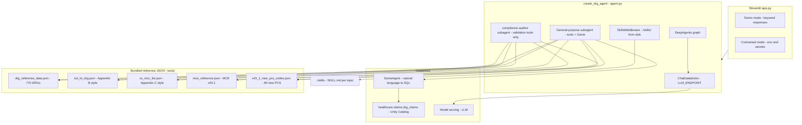

# DRG Claims Agent — Architecture

This document describes how the Streamlit app, DeepAgents runtime, Databricks Genie, custom tools, and on-disk **skills** fit together.

## High-level diagram

## Components

### 1. Streamlit UI (`app.py`)

- **Demo:** No Databricks; responses come from `get_demo_response()` (sample tables and text).
- **Connected:** User provides or loads `DATABRICKS_HOST`, `DATABRICKS_TOKEN`, `LLM_ENDPOINT`, `GENIE_SPACE_ID` (from environment, `.env`, or `st.secrets`). It sets `os.environ` and calls `create_drg_agent()`.
- The agent instance is cached in `st.session_state` for the session.

### 2. Configuration (`config.py`)

- Loads `.env` via `python-dotenv`.
- **`DRG_AGENT_STRICT`:** When enabled, `validate_production_settings()` ensures host/token/space are not template placeholders.
- **`verify_bundled_reference_data()`:** Ensures required JSON files exist and pass basic counts (770 DRGs, MCE v43.1, 80 PCS, etc.) on every `create_drg_agent()` call.

### 3. Main agent (`agent.py`)

- **`ChatDatabricks`** — endpoint name must exist in the workspace.
- **`GenieAgent`** — `genie_space_id` and auth must allow Genie to run SQL your space is configured for (typically the claims table).
- **`create_deep_agent`** (DeepAgents):
  - **Backend:** `CompositeBackend`: default in-memory `StateBackend` for virtual files; `FilesystemBackend(virtual_mode=True)` mounted at **`/skills/`** → project directory `skills/`. Skills are discovered as `*/SKILL.md` (see DeepAgents `SkillsMiddleware`).
  - **Custom tools (registered on the main graph and on both sub-agent specs as applicable):**
    - `drg_lookup`, `drg_family_lookup` — `drg_reference_data.json`
    - `icd_code_validate`, `cc_mcc_check` — `icd_to_drg.json`, `cc_mcc_list.json`
    - `drg_shift_analysis` — in-memory **sample** cohorts in `drg_shift.py` (customize for production)
    - `mce_code_check` — `mce_reference.json`
    - `v43_1_pcs_check` — `v43_1_new_pcs_codes.json`
  - **Sub-agents**
    - **claims-data-analyst:** the **Genie** `GenieAgent` for open-ended **SQL** on the claims table.
    - **compliance-auditor:** same validation tools, no separate Genie instance (tunes routing for audit-style work).
  - **Built-in Deep Agents tools (not listed in our repo):** `write_todos`, file tools, `task` to invoke sub-agents, etc.

### 4. Tool module summary (`tools/`)

| Module | Data source | Role |
|--------|-------------|------|
| `drg_lookup.py` | `drg_reference_data.json` | Table 5: weight, GMLOS, AMLOS, MDC, type |
| `icd_validate.py` | `icd_to_drg.json`, `cc_mcc_list.json` | PDX vs DRG; CC/MCC class |
| `drg_shift.py` | `SAMPLE_SHIFT_DATA` + `DRG_FAMILIES` | Provider MCC-rate comparison (demo data) |
| `mce_validate.py` | `mce_reference.json` | MCE v43.1 PDX/age/flags |
| `pcs_v43_1.py` | `v43_1_new_pcs_codes.json` | “Is this one of 80 new PCS codes?” |
| Parsers | `parse_mce.py`, `parse_v43_1_announcement.py` | Regenerate JSON from CMS text |

### 5. Skills (`skills/`)

Each folder contains a **`SKILL.md`** with YAML front matter (`name`, `description`). DeepAgents **SkillsMiddleware** injects discoverable skill metadata so the model can load domain context without stuffing everything in the system prompt at once.

| Skill folder | Focus |
|--------------|--------|
| `drg-fundamentals` | MS-DRG concepts, MDC, payment, CC/MCC |
| `audit-guidelines` | Audit workflow, red flags, HRRP |
| `drg-shift-analysis` | DRG shift methodology |
| `clinical-reference` | Table schema, discharge status, payers |
| `medicare-mce` | MCE vs grouper, `mce_code_check` |
| `v43-1-pcs-availability` | 80 new PCS, effective 2026-04-01 |

### 6. Data plane (Databricks)

- **Catalog / table:** Default discussion target is `healthcare.claims.drg_claims` (see notebook under `notebooks/`).
- **Genie** must be configured with access to that table (or you update the system prompt and Genie data documentation to match your real names).
- The **LLM** does not read the warehouse directly; **Genie** (and your tools) do.

## Request flow (Connected mode)

1. User message → Streamlit → `create_drg_agent()` (once) → `agent.invoke({"messages": ...})`.
2. Deep agent chooses: **SQL / Genie** (sub-agent), **tool** (ICD, DRG, MCE, etc.), or **file / todo** utilities.
3. Genie returns SQL result text; tools return **JSON strings**; the main LLM composes the final answer.
4. Skills are available through the skills middleware (progressive disclosure per DeepAgents).

## What is *not* in this repo

- Full **MS-DRG grouper** executable (weights/tables are approximated via JSON for lookups; true grouping uses CMS software in billing systems).
- **Real claims** (notebook inserts samples only).
- **Automated** DRG shift from production: replace `SAMPLE_SHIFT_DATA` with Genie queries in a future iteration.

## Security and production

- Secrets: **never** commit `.env`; use **Streamlit secrets** or secret scopes in deployment.
- **`DRG_AGENT_STRICT=1`:** Enforced validation before the agent runs with placeholder credentials.
- **Filesystem skills mount** is read-only to `./skills` for the virtual `/skills/` path; other Deep Agents file tools use the default in-memory state unless you reconfigure the backend.
- For PHI: add org-specific controls, audit logging, and BAA/BA requirements outside this repository.

## Extension points

- **New tool:** add a function in `tools/`, export in `tools/__init__.py`, register in `agent.py` and in `DRG_SYSTEM_PROMPT` routing.
- **New skill:** add `skills/<id>/SKILL.md` with valid front matter.
- **New CMS year:** re-import Table 5 / appendices; rerun parsers; bump version fields in JSON and skills.
